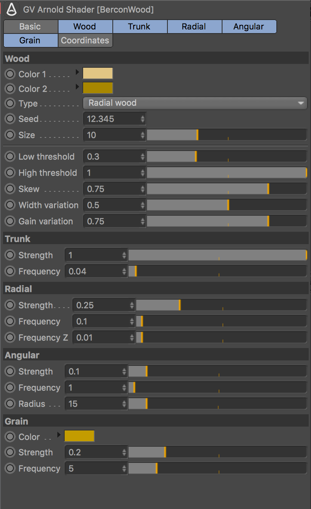
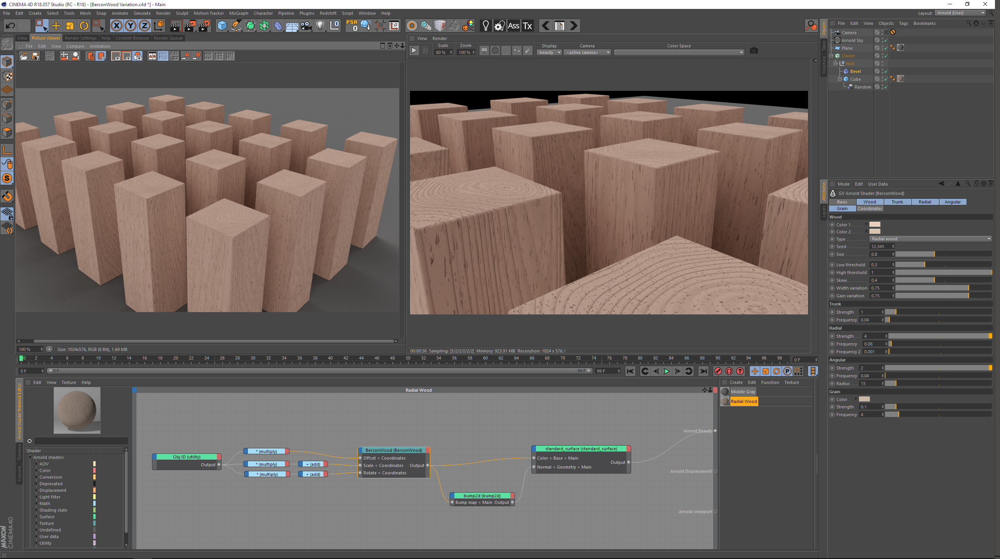
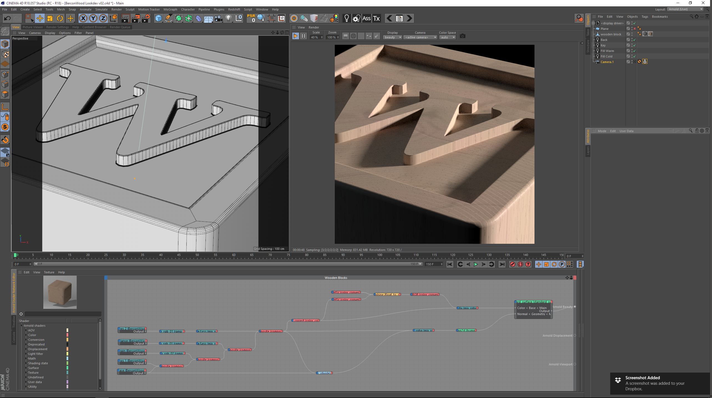

Arnold BerconWood
=================

Arnold BerconWood shader based on Jerry Ylilammi’s [BerconMaps](https://github.com/Bercon/BerconMaps).  
[Download compiled binaries for Linux, Windows & MacOS](https://github.com/SenH/Arnold-BerconWood/releases/latest).

